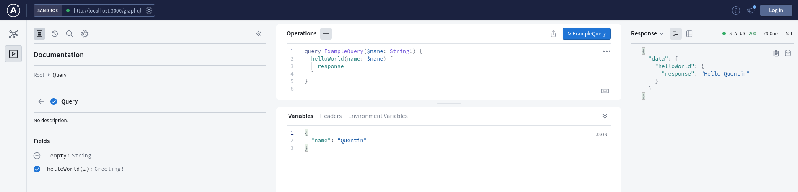

# Cravel Service

This application provides the backend for Cravel UI applications.

## Running the application

Node Version Manager is the recommended way to install node:

https://github.com/nvm-sh/nvm

This project uses [Yarn](https://yarnpkg.com/) as it's package manager. To install Yarn run the following command:

```
npm install -g yarn
```

Next, to ensure the recommended node version is being used when running the project run the following command:

```
nvm use
```

Finally, once all dependencies are installed the app can be run with the following command

```
yarn dev
```

Once the app is running visit `http://localhost:3000/graphql` and enter Apollo Studio and run a example query



## Working With GraphQL

This project uses [GraphQL Code Generator](https://www.graphql-code-generator.com/) to work with GraphQL.
When making schema changes run the following command:

```
yarn codegen
```

## Code Quality And Pre-Commit

This project uses Prettier and ESLint to enforce code style

Running the following command will lint the project for code issues

```
yarn lint
```

Then running the following command will fix code style issues

```
yarn lint:fix
```

This project has [Husky](https://github.com/typicode/husky) set up to automatically format git staged files when making a new commit.

The commit message will also be linted using [Conventional Commits](https://www.conventionalcommits.org/en/v1.0.0/). For more info on allowed messages see the [Commit Lint Config](https://github.com/conventional-changelog/commitlint/tree/master/%40commitlint/config-conventional)
